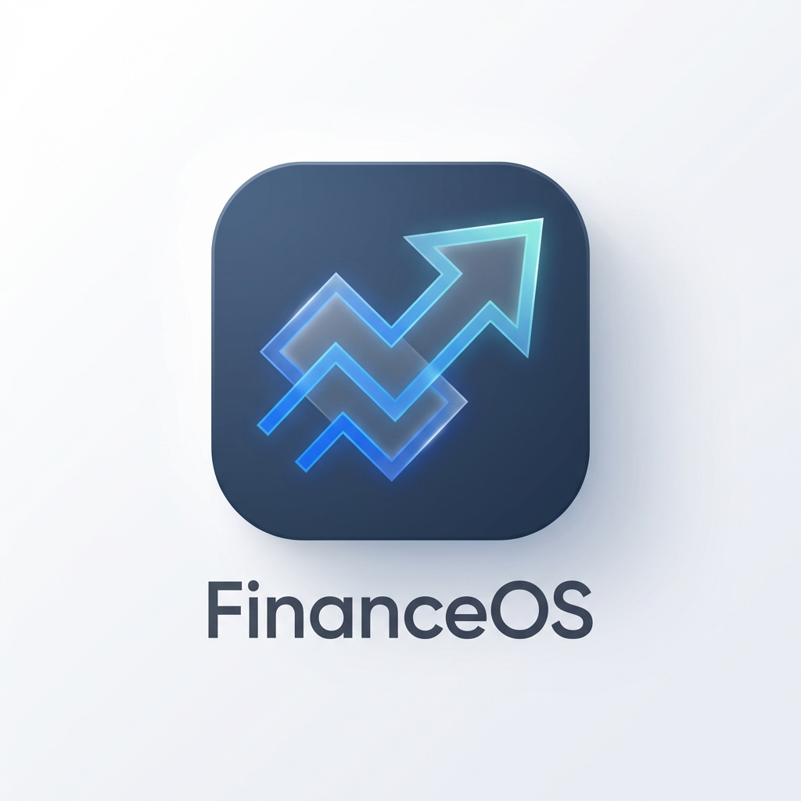

# FinanceOS Native 🏹📊

Finanças pessoais reinventadas com IA, Gestão Nativa (PWA) e Integração WhatsApp.



## ✨ Funcionalidades

- **Dashboard Analítico**: Gráficos dinâmicos com filtros de Ano, Mês, Semana e Dia.
- **Assistente IA (Commander)**: Registo de transações via linguagem natural ou upload de documentos (PDF/Imagens).
- **Multi-IA Support**: Escolha entre DeepSeek (API) e Ollama (Local) para processar os seus dados.
- **Integração WhatsApp**: Registe gastos instantaneamente via Evolution API.
- **Experiência Nativa (PWA)**: Instale o FinanceOS no seu telemóvel para acesso rápido e modo ecrã inteiro.
- **Backend Robusto**: Desenvolvido com Django e integrado com NocoDB para base de dados escalável.

## 🚀 Como Executar

### Via Docker (Recomendado)

1.  Clone o repositório:
    ```bash
    git clone https://github.com/PascoalCaz/Finance-Os.git
    cd Finance-Os
    ```
2.  Configure o seu ficheiro `.env` com as chaves necessárias (NocoDB, DeepSeek/Ollama).
3.  Execute o container:
    ```bash
    docker-compose up --build
    ```
4.  Aceda em `http://localhost:8000`.

### Manualmente

1.  Crie um ambiente virtual: `python -m venv venv`.
2.  Instale as dependências: `pip install -r requirements.txt`.
3.  Execute as migrações: `python manage.py migrate`.
4.  Inicie o servidor: `python manage.py runserver`.

## 🛠️ Tecnologias

- **Framework**: Django (Python)
- **Base de Dados**: SQLite3 (Local) + NocoDB (API)
- **Frontend**: HTMX, Alpine.js, Chart.js, Tailwind CSS
- **IA/OCR**: OpenAI API (DeepSeek), Tesseract OCR, PDFPlumber, Ollama
- **Mensageria**: Evolution API (WhatsApp)

---

Desenvolvido por **Pascoal Caz** 🎻🏹
